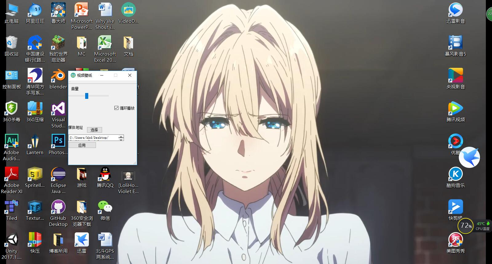

# VideoDesktop-视频壁纸

**VideoDesktop**采用Qt编写，是轻量级的桌面壁纸程序。
 
- **功能简洁** ：一键设置壁纸，通过滑块控制音量大小。
- **方便拓展** ：可以拓展为将其它软件界面置于桌面的效果。
`include <finddesktop.h>
SendMessageToDesktop();//发送消息
HWND desktopWnd=findDesktopIconWnd();//获取桌面句柄
SetParent(yourHwnd,desktopWnd);//设置父窗口
`

-------------------
###DEMO展示
